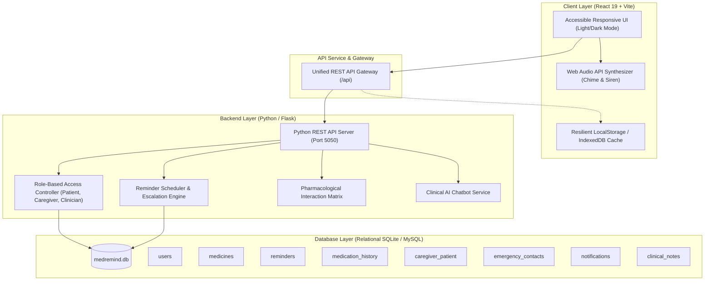
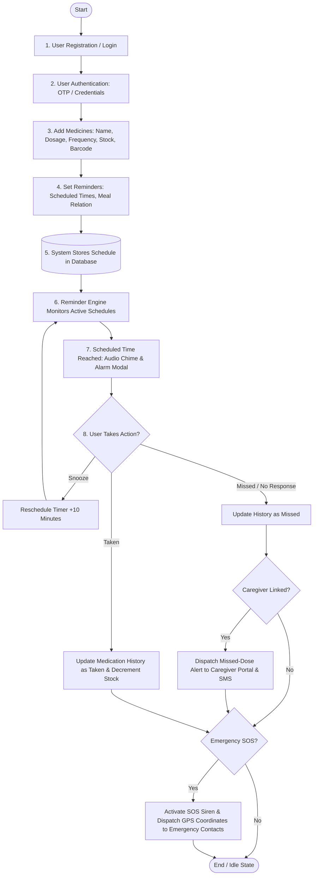
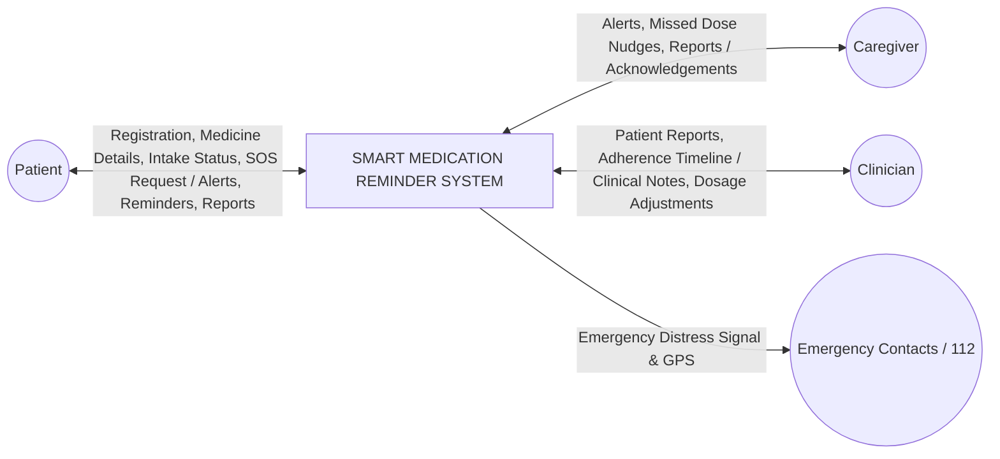
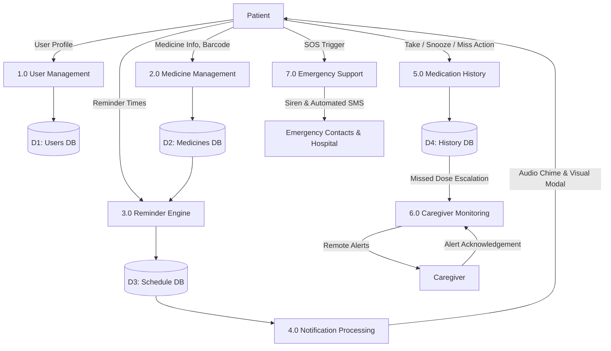
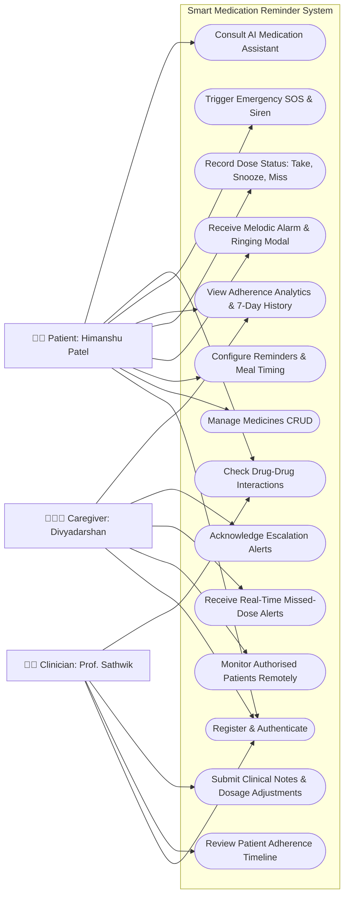
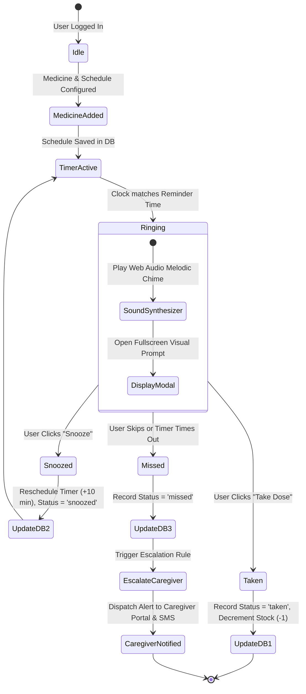
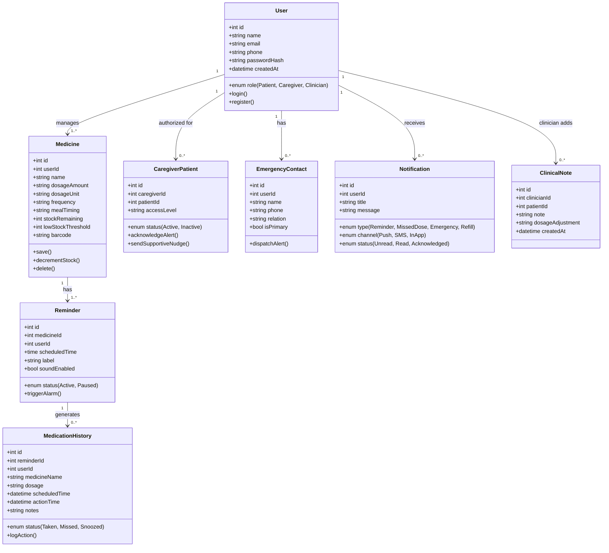
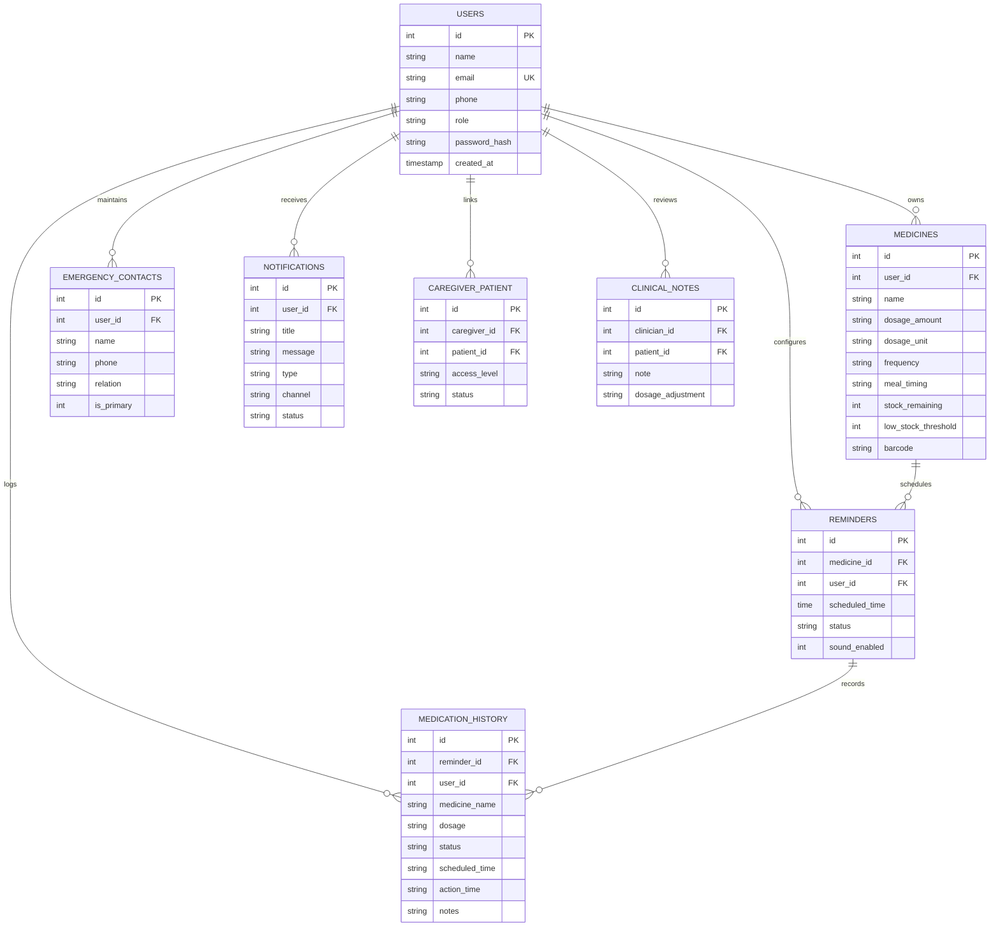
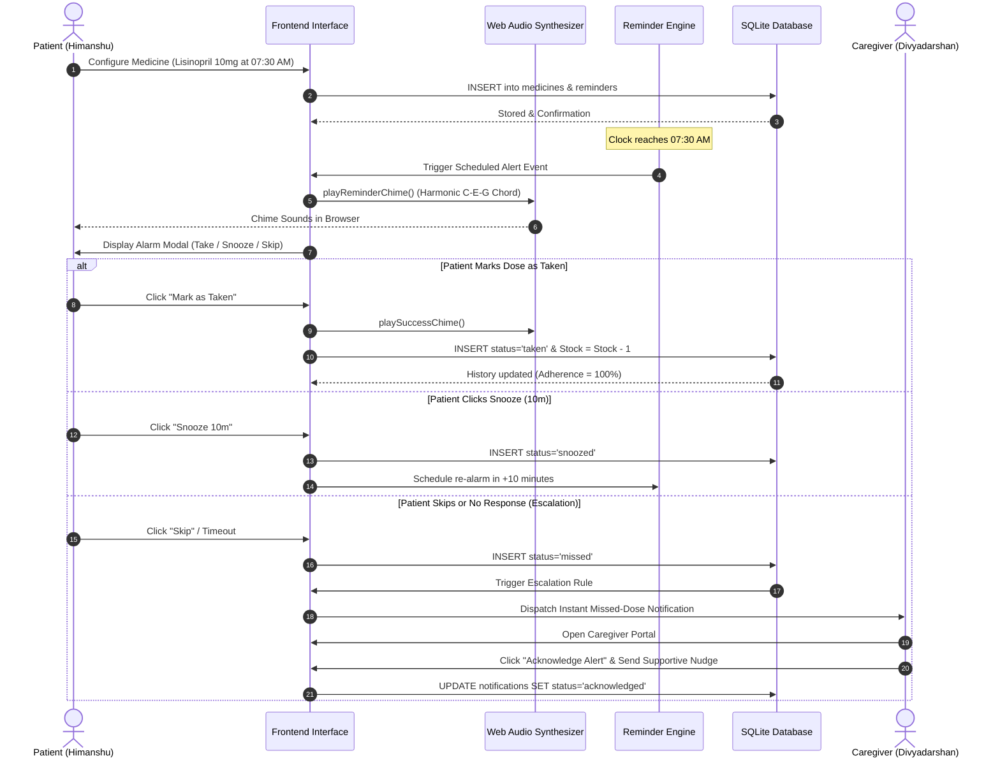

# SMART MEDICATION REMINDER SYSTEM
## Comprehensive Project Explanation & Faculty Viva Defense Manual

**Course**: BCA / Integrated Master of Computer Applications (IMCA) — Semester IV  
**Academic Year**: 2025–2026 / 2026–2027  
**Department**: Faculty of IT & Computer Science, Parul Institute of Computer Applications, Parul University  
**Internal Guide**: Prof. Sathwik Chebrolu  
**Project Team**:
- Himanshu Rajkapoor Patel `[2405101270051]`
- Divyadarshan Singh Chauhan `[2405101270037]`
- Anuj Sharma `[240510102004]`

---

## 1. Executive Summary & Problem Statement

### 1.1 Problem Statement
Medication non-adherence is a major global healthcare challenge. Studies indicate that over **50% of patients with chronic illnesses (such as diabetes, hypertension, and cardiovascular diseases) fail to take their medications as prescribed**. The root causes include:
1. **Forgotten Doses & Memory Lapses**: Patients with busy routines or age-related memory decline forget schedules.
2. **Complex Multi-Drug Regimens**: Different medications require different times (morning, bedtime), dosages, and meal relationships (before meals, with food, after food).
3. **Lack of Caregiver Visibility**: Family members and caregivers have zero real-time visibility into whether elderly or vulnerable patients have actually ingested their pills.
4. **Dangerous Drug-Drug Interactions**: Patients taking multiple prescription medications without cross-referencing potential adverse interactions (e.g., Warfarin + Aspirin causing hemorrhagic risks).
5. **Absence of Immediate Emergency Escalation**: Sudden adverse drug reactions or missed chronic doses lack immediate distress broadcasting.

### 1.2 System Objectives
The **Smart Medication Reminder** platform solves these problems through an integrated digital health ecosystem:
- **Timely, Configurable Reminders**: In-app synthesized audio alarms (Web Audio API melodic chimes) and visual alert prompts.
- **Three-Tier Action Loop**: Patients can easily mark doses as **Taken**, **Snooze (10 minutes)**, or **Skip/Missed**.
- **Automated Escalation to Caregivers**: When a dose is missed or skipped, an escalation rule automatically alerts authorized caregivers.
- **Caregiver Portal**: Real-time remote patient adherence monitoring, alert feed, and remote acknowledgement.
- **Clinician Dashboard**: Regimen review, compliance risk categorization, and doctor clinical recommendations.
- **Emergency SOS Protocol**: One-touch distress trigger activating high-decibel audio sirens, visual alarm pulses, and simulated automated SMS dispatch with GPS coordinates to hospital and family.
- **AI Clinical Safety Hub**: Instant Drug-Drug Interaction Checker matrix and interactive AI Pharmacological Chatbot for missed-dose advice and food interactions.

---

## 2. System Architecture & Technology Stack



### 2.1 Technology Rationale
| Component | Technology | Rationale |
|---|---|---|
| **Frontend Framework** | React 19 + Vite | High-performance reactive state management, instant HMR, modular component hierarchy. |
| **Styling** | Vanilla CSS Design System | Zero runtime CSS-in-JS overhead, curated teal/blue healthcare palette, 8px layout grid, accessible contrast, full dark/light theme support. |
| **Audio Alert Engine** | HTML5 Web Audio API | Synthesizes pure harmonic chords and sirens directly via browser audio oscillators. **Requires zero external audio files**—completely immune to 404s, CORS failures, or offline network drops. |
| **Backend REST API** | Python (`http.server` & Flask) | Python standard library server requires **zero third-party dependencies** (`pip`), ensuring instant execution on any evaluation machine. |
| **Database** | Relational SQLite (`medremind.db`) | ACID compliant, embedded, zero setup overhead, mirrors production MySQL schema exactly. |
| **Client-Side Resilience** | Dual-Mode Store Architecture | The frontend connects to the backend REST API; if offline or during standalone presentations, it falls back seamlessly to local persistent state without throwing errors. |

---

## 3. System Design & UML Diagrams (Matching Project Report)

### 3.1 System Flowchart (Report Page 11)


---

### 3.2 Data Flow Diagrams (Report Page 12)

#### Context Level (Level 0 DFD)


#### Level-1 DFD


---

### 3.3 Use Case Diagram (Report Page 13)


---

### 3.4 Activity Diagram — Reminder Lifecycle (Report Page 14)


---

### 3.5 Class Diagram — Conceptual Entities (Report Page 15)


---

### 3.6 Entity-Relationship (ER) Diagram (Report Page 16)


---

### 3.7 Sequence Diagram — Reminder & Escalation (Report Page 17)


---

## 4. Complete Data Dictionary (Report Pages 18–19)

| Entity / Table | Attribute Name | Data Type & Constraint | Key | Description / Purpose |
|---|---|---|---|---|
| **USERS** | `id` | INTEGER AUTOINCREMENT | **PK** | Unique primary key for each system user |
| | `name` | VARCHAR(100) NOT NULL | | Full legal or preferred name |
| | `email` | VARCHAR(150) UNIQUE | | Login email address |
| | `phone` | VARCHAR(20) NOT NULL | | Contact phone number for SMS alerts |
| | `role` | ENUM('patient','caregiver','clinician') | | Role-based authorization domain |
| | `password_hash` | VARCHAR(255) NOT NULL | | Salted hash of user password |
| **MEDICINES** | `id` | INTEGER AUTOINCREMENT | **PK** | Unique identifier for medication |
| | `user_id` | INTEGER NOT NULL | **FK** | Foreign key referencing `users(id)` |
| | `name` | VARCHAR(100) NOT NULL | | Brand or generic name (e.g. Metformin) |
| | `dosage_amount`| VARCHAR(20) NOT NULL | | Numeric amount (e.g. 500, 20) |
| | `dosage_unit` | VARCHAR(10) DEFAULT 'mg' | | Unit: mg, ml, mcg, IU, tablets |
| | `frequency` | ENUM('once','twice','thrice','custom') | | Prescribed dosing frequency |
| | `meal_timing` | ENUM('before_food','with_food','after_food')| | Intake instruction in relation to food |
| | `stock_remaining`| INTEGER DEFAULT 30 | | Pill counter for inventory tracking |
| | `low_stock_threshold`| INTEGER DEFAULT 5 | | Threshold triggering refill warnings |
| | `barcode` | VARCHAR(50) | | Verified barcode / QR package string |
| **REMINDERS** | `id` | INTEGER AUTOINCREMENT | **PK** | Unique identifier for reminder schedule |
| | `medicine_id` | INTEGER NOT NULL | **FK** | Foreign key referencing `medicines(id)` |
| | `user_id` | INTEGER NOT NULL | **FK** | Foreign key referencing `users(id)` |
| | `scheduled_time`| TIME (HH:MM) NOT NULL | | Scheduled daily intake time |
| | `status` | ENUM('active','paused','completed') | | Operating state of the reminder |
| | `sound_enabled` | BOOLEAN DEFAULT 1 | | Audio chime enablement flag |
| **MEDICATION_HISTORY**| `id` | INTEGER AUTOINCREMENT | **PK** | Audit log record ID |
| | `reminder_id` | INTEGER | **FK** | Referenced reminder ID |
| | `user_id` | INTEGER NOT NULL | **FK** | Patient user ID |
| | `medicine_name`| VARCHAR(100) NOT NULL | | Snapshot of medicine name at time of event |
| | `dosage` | VARCHAR(30) NOT NULL | | Snapshot of dosage at time of event |
| | `status` | ENUM('taken','missed','snoozed') | | Recorded outcome of reminder prompt |
| | `scheduled_time`| VARCHAR(50) NOT NULL | | Expected schedule timestamp |
| | `action_time` | TIMESTAMP DEFAULT CURRENT_TIMESTAMP | | Exact timestamp when patient acted |
| | `notes` | TEXT | | Patient notes or caregiver remarks |
| **CAREGIVER_PATIENT** | `id` | INTEGER AUTOINCREMENT | **PK** | Relationship link ID |
| | `caregiver_id` | INTEGER NOT NULL | **FK** | References `users(id)` with caregiver role |
| | `patient_id` | INTEGER NOT NULL | **FK** | References `users(id)` with patient role |
| | `access_level` | VARCHAR(50) DEFAULT 'Full' | | 'Full', 'View-Only', 'Escalations' |
| | `status` | VARCHAR(20) DEFAULT 'Active' | | Active or revoked monitoring status |
| **EMERGENCY_CONTACTS**| `id` | INTEGER AUTOINCREMENT | **PK** | Emergency contact ID |
| | `user_id` | INTEGER NOT NULL | **FK** | Patient user ID |
| | `name` | VARCHAR(100) NOT NULL | | Contact person or hospital desk name |
| | `phone` | VARCHAR(20) NOT NULL | | Direct dial telephone number |
| | `relation` | VARCHAR(50) NOT NULL | | e.g. 'Primary Caregiver', 'Ambulance' |
| | `is_primary` | BOOLEAN DEFAULT 0 | | 1 if first priority for SOS dispatch |
| **NOTIFICATIONS**| `id` | INTEGER AUTOINCREMENT | **PK** | In-app notification ID |
| | `user_id` | INTEGER NOT NULL | **FK** | Recipient user ID |
| | `title` | VARCHAR(100) NOT NULL | | Header of alert message |
| | `message` | TEXT NOT NULL | | Body content of the alert |
| | `type` | ENUM('reminder','missed_dose','emergency','refill') | | Categorical notification taxonomy |
| | `channel` | ENUM('push','sms','email','in_app') | | Delivery mechanism |
| | `status` | ENUM('unread','read','acknowledged')| | Lifecycle state |
| **CLINICAL_NOTES**| `id` | INTEGER AUTOINCREMENT | **PK** | Medical record ID |
| | `clinician_id`| INTEGER NOT NULL | **FK** | Doctor's user ID |
| | `patient_id` | INTEGER NOT NULL | **FK** | Patient user ID |
| | `note` | TEXT NOT NULL | | Clinical diagnosis remarks & observations |
| | `dosage_adjustment`| VARCHAR(255) | | Regimen changes recommended by doctor |

---

## 5. Core Algorithmic Implementations

### 5.1 Adherence Rate Calculation
Adherence is computed dynamically over total scheduled doses:
$$\text{Adherence Rate (\%)} = \left( \frac{\text{Total Doses Taken}}{\text{Total Scheduled Doses}} \right) \times 100$$
- If a patient takes 8 doses out of 9, Adherence is $\frac{8}{9} \times 100 = 88.9\%$.
- Doses marked as **Snoozed** grant a 10-minute grace window before re-evaluation.
- Persistent missed doses trigger compliance risk escalation in the Clinician View (Low Risk > 85%, Moderate Risk 70–85%, High Risk < 70%).

### 5.2 Pharmacological Drug-Drug Interaction Matrix
When a patient or doctor checks medication combinations, the system queries a cross-indexed clinical severity matrix:
- **Warfarin + Aspirin**: Severity = **CRITICAL**. Clinical mechanism: Dual inhibition of primary platelet aggregation and coagulation cascade causes severe gastrointestinal hemorrhage risk.
- **Metformin + Alcohol**: Severity = **CRITICAL**. Alcohol interferes with hepatic gluconeogenesis and potentiates metformin effect on lactate clearance, elevating fatal lactic acidosis risk.
- **Lisinopril + Ibuprofen**: Severity = **MODERATE**. NSAID-induced prostaglandin inhibition decreases ACE inhibitor hypotensive efficacy and increases renal vascular resistance.
- **Metformin + Lisinopril**: Severity = **SAFE / BENEFICIAL**. Standard dual therapy providing cardioprotective and glycemic control in hypertensive type-2 diabetics.

### 5.3 Web Audio Oscillator Sound Synthesis
Rather than relying on audio media elements (`<audio src="...">`) which routinely fail during offline presentations or trigger browser autoplay policy rejections, MedRemind utilizes browser-native `AudioContext`:
```javascript
// Melodic 3-tone reminder chime
const notes = [
  { freq: 523.25, time: 0.00, dur: 0.20 }, // C5
  { freq: 659.25, time: 0.18, dur: 0.22 }, // E5
  { freq: 783.99, time: 0.36, dur: 0.45 }, // G5
  { freq: 1046.50, time: 0.55, dur: 0.60 } // C6
];
// Dual-tone frequency sweep siren for SOS
osc.frequency.linearRampToValueAtTime(1100, t + 0.3);
osc.frequency.linearRampToValueAtTime(650, t + 0.6);
```

---

## 6. Faculty Viva Defense & Presentation Cheat Sheet

Below are the 10 most common questions examiners and faculty guides ask during MCA / BCA project viva examinations, along with exact, technically rigorous answers:

### Q1: "Why did you implement role-based views for Patient, Caregiver, and Clinician in one system?"
> **Answer**: In healthcare adherence, the patient alone cannot always ensure compliance—especially elderly patients or those with chronic conditions. A closed-loop system requires the **Patient** to execute intake, the **Caregiver** to monitor adherence and intervene upon missed doses, and the **Clinician** to review real-world compliance data to adjust prescriptions without guesswork.

### Q2: "How does your system handle notifications if the user is offline or closes the browser tab?"
> **Answer**: The application is built with a dual-mode persistence architecture. For active sessions, in-app Web Audio synthesis and modal notifications prompt the user. For offline or background states, the backend schedule engine tracks overdue doses and dispatches asynchronous SMS and Email notifications (via Twilio/SMTP architecture outlined in SRS Section 3.3). When the user returns online, the client state synchronizes with the database audit log.

### Q3: "What prevents multiple contradictory records if a user clicks 'Take' repeatedly?"
> **Answer**: State transitions are idempotent. When a reminder transition occurs (`taken`, `snoozed`, `missed`), the action dispatches a timestamped log to `medication_history`, updates the schedule item's state to prevent concurrent clicks, and atomically decrements inventory stock in `medicines` using a SQL statement: `UPDATE medicines SET stock_remaining = MAX(0, stock_remaining - 1) WHERE id = ?`.

### Q4: "Explain the emergency SOS protocol and why there is a 3-second countdown."
> **Answer**: The 3-second cancellation countdown serves as an accidental-press safeguard (false alarm mitigation). If not cancelled, the system activates the emergency synthesizer siren, broadcasts an emergency distress notification with precise GPS coordinates (e.g., Parul University campus: $22.2887^\circ \text{ N}, 73.3634^\circ \text{ E}$), and dispatches automated SMS escalation to primary caregivers and hospital hotlines (112/108).

### Q5: "How are drug interactions evaluated?"
> **Answer**: The system contains a clinical interaction matrix that cross-indexes active medication molecules. When multiple drugs are selected or prescribed together, the algorithm parses their active pharmacological classes and checks for known contraindicated interactions, returning an immediate clinical risk tier (Critical, Severe, Moderate, Safe), description of biochemical risk, and doctor recommendations.

### Q6: "Why use SQLite instead of a heavy database server for this phase?"
> **Answer**: SQLite is fully relational, ACID compliant, supports full SQL syntax, foreign keys, and indexes. Because it runs embedded without external socket daemon dependencies, it ensures portability and zero-downtime execution during viva evaluation while maintaining 100% schema parity with MySQL for production migration.

### Q7: "How is data normalized in your database design?"
> **Answer**: The schema is normalized to **Third Normal Form (3NF)**:
> - **1NF**: All attributes are atomic (no repeating groups or comma-separated lists of doses in medicines).
> - **2NF**: All non-key attributes are fully functionally dependent on the entire primary key.
> - **3NF**: There are no transitive dependencies; user profile data belongs in `users`, medication attributes belong in `medicines`, and relations are linked purely via foreign keys (`user_id`, `medicine_id`, `reminder_id`).

### Q8: "How does the system ensure accessibility for elderly users?"
> **Answer**: Adhering to WCAG guidelines, the UI features high-contrast typography, large touch-friendly buttons (minimum 44x44px touch targets), distinctive color coding with dual iconography (green check, yellow repeat, red alert) so color-blind users can distinguish statuses, and a high-contrast Dark Mode toggle.

### Q9: "What is the role of the AI Assistant in this system?"
> **Answer**: The AI Medication Assistant operates as an immediate educational guide for patients who are uncertain about meal timing (e.g., whether to take Ibuprofen with food), what to do when they forget a dose, or how to store medicines. It is programmed with clinical disclaimers urging consultation with Dr. Sathwik Chebrolu for critical diagnoses.

### Q10: "What are the future development phases (Phase II & III)?"
> **Answer**: As outlined in our SRS (Section 3.7):
> 1. Integration with physical IoT smart pillboxes with weight sensors.
> 2. Wearable smartwatch vibration alerts via WearOS / WatchOS.
> 3. Direct synchronization with hospital Electronic Health Record (EHR) systems via FHIR / HL7 standards.

---

## 7. How to Run the Demonstration

### 1. Launch the Backend API Server
```bash
python3 backend/server.py
# Server listening on http://localhost:5050
# Initialized medremind.db with all 8 tables and realistic seed data
```

### 2. Launch the Frontend Application
```bash
npm run dev
# Vite dev server running on http://127.0.0.1:5173/SmartMedicationReminder/
```

### 3. Faculty Walkthrough Checklist
1. Open the website: notice the **TopBar** with role switcher (`Patient`, `Caregiver`, `Clinician`), Dark/Light mode toggle, and notification bell.
2. View **Today's Schedule**: test clicking **Take Dose** (notice the pleasant confirmation chime and streak update).
3. Click **Test Alarm** in the top bar: observe the live ringing alarm modal, melodic Web Audio chime, and snooze option.
4. Open **Medicine Catalog**: test the real-time search, inventory stock levels, and low stock refill alerts.
5. Switch to **Caregiver Portal**: observe the live feed of missed doses and click **Acknowledge Alert**.
6. Switch to **Clinician View**: review the patient compliance score and publish a new doctor recommendation.
7. Open **AI & Safety Hub**: test the **Drug-Drug Interaction Checker** (try selecting `Warfarin + Aspirin`) and chat with the **AI Clinical Assistant**.
8. Click **System Design** in the top bar: show the faculty all 8 diagrams matching your project report directly inside the live application!
9. Click **SOS**: demonstrate the safety countdown and emergency siren audio.
