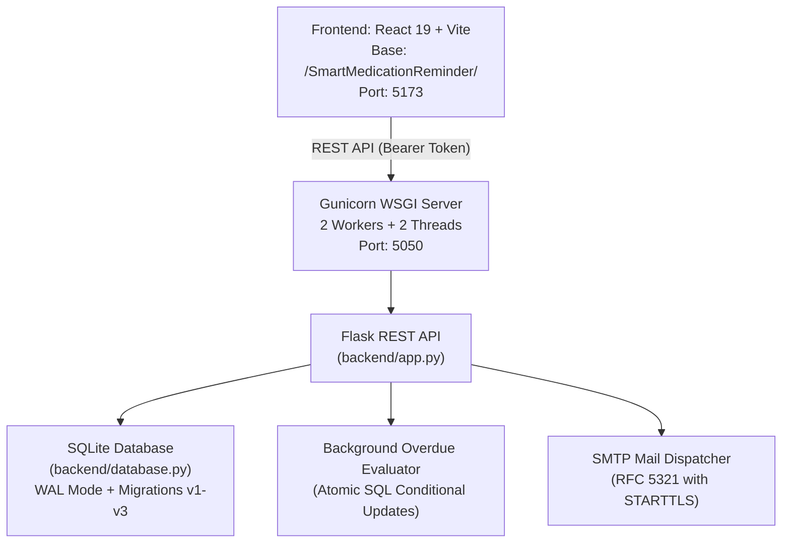

# Smart Medication Reminder (MedRemind)

**Institution**: Parul University — Semester IV IMCA / BCA Final Project  
**Project Guide**: Prof. Sathwik Chebrolu  
**Authors**: Himanshu Patel & Divyadarshan Chauhan  
**Status**: Production-Hardened (Phases 0–5 Complete, 57/57 Automated Tests Passing)

---

## 1. Overview

**Smart Medication Reminder (MedRemind)** is an enterprise-grade, full-stack clinical adherence application designed to safeguard patient health through strict medication schedules, two-step verification, patient-approved caregiver linking, concrete dose tracking, multi-tier non-spam escalations, and automated drug interaction safety checks.

The system replaces fragile client-side state with a single source of truth: a high-performance Flask REST backend backed by SQLite with versioned schema migrations, sliding-window rate limiting, and atomic state machine transitions.

---

## 2. System Architecture



### Key Architectural Pillars
- **Frontend**: React 19, Vite, bespoke CSS design system (glassmorphism, modern typography, responsive layout), Lucide icons, persistent offline banner, and dedicated screens for Patients, Caregivers, and Clinicians.
- **Backend**: Python 3.12 Flask REST API served by Gunicorn, featuring session-token authentication, strict RBAC, rate-limiting middleware, security headers (CSP, HSTS, X-Frame-Options, X-Content-Type-Options), and sanitized error handling.
- **Database**: SQLite 3 with Write-Ahead Logging (WAL), foreign-key constraints, versioned schema migrations (`version 1`, `version 2`, `version 3`), and 14 relational tables.
- **Security**: PBKDF2-HMAC-SHA256 password hashing (100k iterations, random salts), HMAC-SHA256 OTP verification with per-code salt and constant-time comparison, locked user directory, and zero sensitive leaks in production logs.

---

## 3. Technology Stack

| Layer | Technologies |
|---|---|
| **Frontend** | React 19, JavaScript (ES2024), Vite 7, Vanilla CSS, Lucide React |
| **Backend** | Python 3.12, Flask 3.0, Flask-CORS, Gunicorn 21.2 |
| **Database** | SQLite 3 (WAL mode, versioned migrations) |
| **Security & Auth** | PBKDF2-HMAC-SHA256, HMAC-SHA256 OTP with salt, Signed Sessions |
| **Testing** | Pytest 8.0+, Requests, Live Server E2E Smoke Scripts |
| **Containerization** | Docker (`python:3.12-slim`), Non-root user `appuser`, Healthcheck |

---

## 4. Setup & Installation

### Prerequisites
- **Node.js**: v18.0.0 or higher
- **npm**: v9.0.0 or higher
- **Python**: v3.12.x (compatible with 3.12–3.14)

### 1. Clone the Repository
```bash
git clone https://github.com/Himanshuptel/SmartMedicationReminder.git
cd SmartMedicationReminder
```

### 2. Configure Environment Variables
Copy the template configuration:
```bash
cp .env.example .env
```
For local development, the default settings in `.env.example` enable `DEMO_MODE=true` with instant local console OTPs. For production deployments, update the `.env` file according to the Environment Variables Table below.

### 3. Setup Python Backend Environment
```bash
python3 -m venv .venv
source .venv/bin/activate
pip install --upgrade pip
pip install -r requirements.txt
```

### 4. Initialize Database
Initialize the SQLite schema, execute migrations, and seed default demonstration data:
```bash
python backend/database.py --init --seed
```

### 5. Install Frontend Dependencies
```bash
npm install
```

---

## 5. Running the Application

### Development Mode (Simultaneous Dev Servers)

#### Terminal 1: Backend Server
```bash
source .venv/bin/activate
export DEMO_MODE=true
export PORT=5050
python backend/app.py
```
*Backend runs at `http://127.0.0.1:5050`.*

#### Terminal 2: Frontend Dev Server
```bash
npm run dev
```
*Frontend runs at `http://localhost:5173/SmartMedicationReminder/` with automatic API proxying to port 5050.*

### Production Mode (Gunicorn WSGI)

```bash
source .venv/bin/activate
export DEMO_MODE=false
export SECRET_KEY="your-minimum-32-character-cryptographic-secret-key"
export ALLOWED_ORIGINS="https://yourfrontend.domain.com"
export SMTP_HOST="smtp.gmail.com"
export SMTP_PORT="587"
export SMTP_USER="your-email@gmail.com"
export SMTP_PASS="your-app-password"
export SMTP_FROM="noreply@smartmedicationreminder.com"

gunicorn --bind 0.0.0.0:5050 --workers 2 --threads 2 backend.app:app
```

### Docker Container Deployment

Build and run using the production Dockerfile:
```bash
# Build the Docker image (Python 3.12 base)
docker build -t medremind-backend:latest .

# Run container with persistent data volume
docker run -d \
  --name medremind-api \
  -p 5050:5050 \
  -v medremind-data:/app/data \
  -e DEMO_MODE=false \
  -e SECRET_KEY="a-secure-production-secret-key-min-32-chars-long" \
  -e ALLOWED_ORIGINS="https://yourfrontend.com" \
  -e SMTP_HOST="smtp.gmail.com" \
  -e SMTP_PORT="587" \
  -e SMTP_USER="app@gmail.com" \
  -e SMTP_PASS="app-password" \
  -e SMTP_FROM="noreply@domain.com" \
  medremind-backend:latest
```

---

## 6. Verification & Automated Testing

The codebase includes an exhaustive test suite with 100% automated pass rates.

### Run Full Pytest Suite
```bash
source .venv/bin/activate
pytest tests/test_api.py -v
```
*Executes all 57 automated tests across RBAC, OTP security, dose instance state machine, timezones, multi-worker concurrency, rate limiting with fake clocks, and sanitized errors.*

### Run Live Server E2E Smoke Test
```bash
source .venv/bin/activate
python scripts/e2e_smoke_test.py
```
*Verifies live registration, HMAC OTP verification, session generation, dose state machine, and invite code redemption against an active HTTP server.*

### Build Frontend Production Assets
```bash
npm run build
```
*Compiles static production bundle into `dist/` with base path `/SmartMedicationReminder/`.*

---

## 7. Environment Variables Reference

| Variable | Default Value | Required in Production? | Description |
|---|---|---|---|
| `PORT` | `5050` | No | Port on which Flask / Gunicorn binds |
| `DATABASE_PATH` | `backend/medremind.db` | No | Absolute or relative path to SQLite database file |
| `DEMO_MODE` | `true` | **Yes** | When `false`, enables production safety checks, disables console OTPs, and suppresses demo shortcuts |
| `SECRET_KEY` | *(dev fallback key)* | **Yes** (`DEMO_MODE=false`) | Cryptographic secret for HMAC OTP hashing and session signing (min 32 chars) |
| `ALLOWED_ORIGINS` | `http://localhost:5173,...` | **Yes** (`DEMO_MODE=false`) | Permitted CORS origins (comma-separated). Wildcard `*` is strictly forbidden in production |
| `SMTP_HOST` | *(empty)* | **Yes** (`DEMO_MODE=false`) | Hostname of SMTP mail server (e.g. `smtp.gmail.com`) |
| `SMTP_PORT` | `587` | **Yes** (`DEMO_MODE=false`) | Port for SMTP mail server (typically `587` for STARTTLS) |
| `SMTP_USER` | *(empty)* | **Yes** (`DEMO_MODE=false`) | Username/email for SMTP authentication |
| `SMTP_PASS` | *(empty)* | **Yes** (`DEMO_MODE=false`) | Password/app-password for SMTP authentication |
| `SMTP_FROM` | `noreply@smartmedicationreminder.com` | **Yes** (`DEMO_MODE=false`) | Sender email address for outgoing verification codes |
| `ESCALATION_CONSECUTIVE_MISSES` | `3` | No | Number of consecutive missed doses required to trigger emergency contact escalation |
| `GRACE_WINDOW_MINUTES` | `30` | No | Duration (in minutes) after scheduled time before a pending/snoozed dose is marked missed |
| `RATE_LIMIT_LOGIN_MAX` | `5` | No | Max login requests per IP/email within sliding window (default 60s) |
| `RATE_LIMIT_REGISTER_MAX` | `5` | No | Max registration requests per IP/email within sliding window |
| `RATE_LIMIT_VERIFY_OTP_MAX` | `5` | No | Max OTP verification requests per IP/email within sliding window |
| `RATE_LIMIT_RESEND_OTP_MAX` | `3` | No | Max OTP resend requests per IP/email within sliding window |
| `ENABLE_BACKGROUND_WORKER`| `true` | No | Enables the 60-second background overdue evaluation daemon thread |
| `VITE_API_BASE_URL` | *(empty = relative)* | No | Custom backend URL for frontend if not using relative proxy |

---

## 8. User Roles & Linking Workflow

### Role Matrix

| Role | Access Scope | Key Capabilities |
|---|---|---|
| **Patient** | Personal Data Only | Manage medicines, view daily dose instances, take/snooze/miss doses, generate invite codes, trigger SOS |
| **Caregiver** | Linked Patients Only | View linked patient adherence and active regimen, acknowledge missed dose alerts, redeem invite codes |
| **Clinician** | Linked Patients Only | Monitor cohort compliance rates, review intake history, publish clinical notes and dosage adjustments, redeem invite codes |

### Two-Step Verification (OTP)
1. **Registration**: User submits profile details -> Server stores PBKDF2 password hash, generates a 6-digit cryptographic OTP, computes `HMAC-SHA256(SECRET_KEY, salt + ":" + OTP)`, and delivers the code via SMTP (or console in dev mode). Returns `requires_otp: true` without issuing a session token.
2. **Login**: User provides email and password -> Server validates credentials, generates a new salted HMAC OTP, and dispatches it.
3. **Verification**: User submits the 6-digit code -> Server performs constant-time digest comparison (`hmac.compare_digest`), invalidates the code (single-use), and issues a signed 7-day session token stored in the `sessions` table.

### Patient-Approved Caregiver Linking Flow
To prevent unauthorized monitoring, clinicians and caregivers cannot browse users or unilaterally link to patients:
1. **Generate**: Patient clicks *"Generate Caregiver Link Code"* on their Schedule tab -> Server creates a secure random code (`INV-XXXXXX`) valid for 24 hours.
2. **Share**: Patient shares the code with their family caregiver or healthcare provider.
3. **Redeem**: Caregiver/Clinician navigates to their dashboard, inputs the `INV-XXXXXX` code, and submits.
4. **Authorize**: Server verifies code validity, creates an active mapping in `caregiver_patient`, and marks the invite as redeemed.
5. **Scoping**: All subsequent queries for patient data by the caregiver or clinician verify authorization against `caregiver_patient`. Unlinked requests are rejected with `403 Forbidden` or empty datasets.

---

## 9. Dose Instance Lifecycle & State Machine

```
  [ Reminder ]
       │
       ▼ (Pre-generated for calendar date)
┌──────────────┐      Action: "take"      ┌───────────┐
│   Pending    │ ───────────────────────► │   Taken   │  (Idempotent, Stock -1, Low Stock Alert)
└──────────────┘                          └───────────┘
   │        │
   │        │ Action: "snooze" (+10 min, max 3)
   │        ▼
   │   ┌───────────┐      Action: "take"
   │   │  Snoozed  │ ───────────────────► [ Taken ]
   │   └───────────┘
   │        │
   │        │ 30-Min Grace Period Exceeded OR Action: "miss"
   ▼        ▼
┌──────────────┐
│    Missed    │ ──► Dispatches 1 Caregiver Alert
└──────────────┘ ──► Consecutive Misses >= 3 ──► Emergency Escalation (SMS to Emergency Contacts)
```

- **Adherence Formula**: `Adherence % = (Taken Doses / (Taken Doses + Missed Doses)) * 100`.
- **Streak Calculation**: Counts consecutive days achieving 100% adherence up to today.

---

## 10. Deployment Notes & Ephemeral Disk Considerations

### Production Architecture
- **Frontend**: The frontend is a static Vite build compiled with `base: '/SmartMedicationReminder/'`. It can be hosted on GitHub Pages, Cloudflare Pages, Netlify, Vercel, or AWS S3.
- **Backend**: The backend runs as a standalone Python/Gunicorn service inside Docker on container platforms (Render, Railway, Fly.io, DigitalOcean, or AWS ECS).

### Ephemeral Storage Warning
> [!WARNING]
> **SQLite on Ephemeral Cloud Containers**: Many free or low-cost cloud container providers (e.g., Render free tier, Railway ephemeral instances, Heroku) use ephemeral container filesystems. When the container idles, restarts, or deploys a new build, all changes to an unmounted SQLite file are lost.

#### Recommended Solutions:
1. **Option A (Production with Persistent Disk)**:
   Attach a persistent disk volume to `/app/data` (as configured in the Dockerfile `VOLUME ["/app/data"]`). Point `DATABASE_PATH=/app/data/medremind.db`. The database survives restarts and redeployments seamlessly.
2. **Option B (Demonstration Deployment with Auto-Seed)**:
   If deploying to a free ephemeral host for project evaluation, keep `DEMO_MODE=true`. The database will automatically initialize and reseed demonstration datasets on container startup without manual intervention.

---

## 11. Known Limitations

For academic transparency and clinical audit readiness, please refer to [docs/KNOWN_LIMITATIONS.md](file:///home/khushu/Downloads/Medicine/docs/KNOWN_LIMITATIONS.md) for detailed documentation on simulated external services (Carrier SMS, Cellular SOS 112/911 dispatch, Generative LLM integration, and DDI matrix scope).

---

## 12. Project Documentation Index

- [Project Status & Compliance Matrix](file:///home/khushu/Downloads/Medicine/docs/STATUS.md)
- [End-to-End Verification Checklist](file:///home/khushu/Downloads/Medicine/docs/E2E_CHECKLIST.md)
- [Known Limitations & Architecture](file:///home/khushu/Downloads/Medicine/docs/KNOWN_LIMITATIONS.md)
- [Phase 1 Consolidation Report](file:///home/khushu/Downloads/Medicine/docs/PHASE_1_REPORT.md)
- [Phase 2 Authentication Report](file:///home/khushu/Downloads/Medicine/docs/PHASE_2_REPORT.md)
- [Phase 3 Core Medication Logic Report](file:///home/khushu/Downloads/Medicine/docs/PHASE_3_REPORT.md)
- [Phase 4 Frontend UI & Dose Lifecycle Report](file:///home/khushu/Downloads/Medicine/docs/PHASE_4_REPORT.md)
- [Phase 5 Production Hardening Report](file:///home/khushu/Downloads/Medicine/docs/PHASE_5_REPORT.md)
